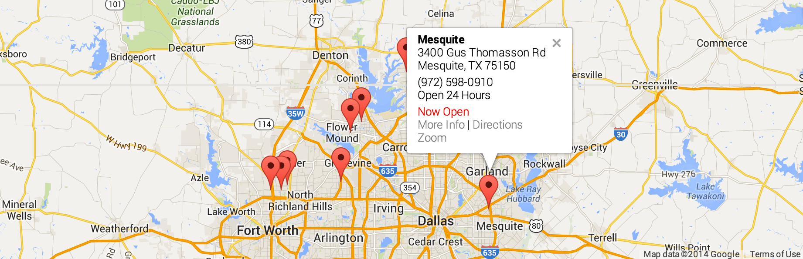

Smart Map plugin for Craft CMS
======================================

**The most comprehensive proximity search and mapping tool for Craft.**


Here are some of the many, many things you can do with Smart Map...

 - [Proximity Search](#proximity-search)
 - [Dynamic and Static Maps](#dynamic-and-static-maps)
 - [Map Customization in Twig](#map-customization-in-twig)
 - [Map Manipulation in JavaScript](#map-manipulation-in-javascript)
 - [Styling a Map](#styling-a-map)
 - [Marker Info Bubbles](#marker-info-bubbles)
 - [Matrix Compatibility](#matrix-compatibility)
 - [Front-end Lookups](#front-end-lookups)
 - [Front-end Entry Form](#front-end-entry-form)
 - [Visitor Geolocation](#visitor-geolocation)
 - [Filter by Subfields](#filter-by-subfields)
 - [Custom Subfield Arrangement](#custom-subfield-arrangement)
 - [Apply KML Files](#apply-kml-files)
 - [Link to Google Directions](#link-to-google-directions)
 - [Fully Translatable](#fully-translatable)
 
**We also provide some of the best customer support in the business.** Find us on [Craft Slack](https://craftcms.com/community#slack), or via the [Intercom widget](https://www.doublesecretagency.com/plugins/) or [contact form](https://www.doublesecretagency.com/contact) on our website. Or simply email us at <support@doublesecretagency.com>.

***

## Proximity Search

It's super easy to conduct a search for the nearest locations.

```twig

```

The results will include a special `distance` value attached to each element.
```twig
{{ entry.myAddressField.distance }}
```

Read the full documentation for [proximity searching...](https://www.doublesecretagency.com/plugins/smart-map/docs/sorting-entries-by-closest-locations)


## Dynamic and Static Maps

With just a single line of code, you can render a full map of your locations.

**Dynamic Map**
```twig
{{ craft.smartMap.map(locations, options) }}
```

**Static Map**
```twig
{{ craft.smartMap.img(locations, options) }}
```

Read the full documentation for [dynamic and static maps...](https://www.doublesecretagency.com/plugins/smart-map/docs/render-a-map-in-twig)


## Map Customization in Twig

You can set a series of options to customize the map before it gets rendered.

```twig

```

Read the full documentation for [map customizations in Twig...](https://www.doublesecretagency.com/plugins/smart-map/docs/customizing-the-map-in-twig)


## Map Manipulation in JavaScript

If you want to manipulate the map further, it's easy to do with custom JavaScript. Each map, marker, and info window are stored within the `smartMap` object.

```javascript
// Map object
smartMap.map['<MAP ID>']

// Marker object
smartMap.marker['<MAP ID>.<ELEMENT ID>.<FIELD HANDLE>']

// Info window object
smartMap.infoWindow['<MAP ID>.<ELEMENT ID>.<FIELD HANDLE>']
```

Read the full documentation for [map manipulation in JavaScript...](https://www.doublesecretagency.com/plugins/smart-map/docs/manipulating-the-map-in-javascript)


## Styling a Map

Styling a map is a common need. You can do it with a single line of JavaScript code.

```javascript
smartMap.styleMap('smartmap-mapcanvas-1', styles);
```

Read the full documentation for [styling a map...](https://www.doublesecretagency.com/plugins/smart-map/docs/styling-a-map)


## Marker Info Bubbles

You'll likely want to add an info window bubble to your markers.

```twig

```

The info bubble is managed in a separate Twig template, so you can customize it however you want.



Read the full documentation for [marker info bubbles...](https://www.doublesecretagency.com/plugins/smart-map/docs/adding-marker-info-bubbles)


## Matrix Compatibility

Displaying locations in a matrix field is similar to using them with entries.

```twig

{{ craft.smartMap.map(locations, options) }}
```

Read the full documentation for [matrix compatibility...](https://www.doublesecretagency.com/plugins/smart-map/docs/how-to-use-with-a-matrix-field)


## Front-end Lookups

It's possible to conduct an address lookup from the front end.

```twig

```

There's a couple other ways to do this as well, including via AJAX.

Read the full documentation for [front-end lookups...](https://www.doublesecretagency.com/plugins/smart-map/docs/front-end-address-lookup)


## Front-end Entry Form

You can submit address values through a standard front-end entry form.

```html
<label>Street Address</label>
<input type="text" name="fields[myAddressField][street1]" value="">

<label>City</label>
<input type="text" name="fields[myAddressField][city]" value="">

<label>State</label>
<input type="text" name="fields[myAddressField][state]" value="">
```

Read the full documentation for [front-end entry forms...](https://www.doublesecretagency.com/plugins/smart-map/docs/front-end-entry-form)


## Visitor Geolocation

Automatically detect where your site's visitors are located.

```twig
{{ craft.smartMap.visitor.ip }}
```

Read the full documentation for [visitor geolocation...](https://www.doublesecretagency.com/plugins/smart-map/docs/visitor-geolocation)


## Filter by Subfields

If needed, you can ensure that only results from a certain area are included.

```twig

```

Read the full documentation for [filtering by subfields...](https://www.doublesecretagency.com/plugins/smart-map/docs/filtering-entries-by-subfield-value)


## Custom Subfield Arrangement

By default, the Address field follows the US address arrangement. Fortunately, you can easily customize it however you see fit.


Read the full documentation for [custom subfield arrangement...](https://www.doublesecretagency.com/plugins/smart-map/docs/internationalization-support)


## Apply KML Files

KML files allow you to add almost limitless shapes to your map.

```twig
{{ craft.smartMap.kml(kmlFile, options) }}
```

Read the full documentation for [using KML files...](https://www.doublesecretagency.com/plugins/smart-map/docs/kml-files)


## Link to Google Directions

It's a piece of cake to generate a link for directions in a Google map:

```twig
{{ entry.myAddressField.directionsUrl }}
```

Read the full documentation for [linking to Google directions...](https://www.doublesecretagency.com/plugins/smart-map/docs/linking-to-a-separate-google-map-page)


## Fully Translatable

The entire plugin is fully translatable. If your language isn't already included, feel free to add your own!

Read the full documentation for [translations...](https://www.doublesecretagency.com/plugins/smart-map/docs/internationalization-support)

***

## Anything else?

We've got other plugins too!

Check out the full catalog at [doublesecretagency.com/plugins](https://www.doublesecretagency.com/plugins)
