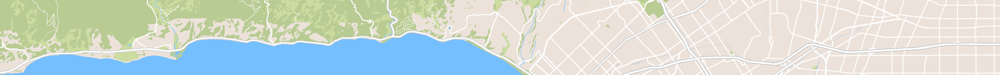

Smart Map plugin for Craft CMS
======================================

**The most comprehensive proximity search and mapping tool for Craft.**

***

Smart Map gives you a powerful "Address" field which allows you to...
 - Do proximity searches (aka "store locator")
 - Create dynamic & static maps
 - Geolocate site visitors
 - Customize a map in Twig
 - Manipulate a map in JavaScript
 - Format a map with custom styles
 - Add info window bubbles
 - Use KML files
 - Fully translatable
 - Compatible with CraftQL!

To see everything that Smart Map can do, check out [doublesecretagency.com/plugins/smart-map](https://www.doublesecretagency.com/plugins/smart-map)

***

## Feedback

For bugs & feature requests, please submit a [Github issue](https://github.com/doublesecretagency/craft-smartmap/issues).

**We provide some of the best customer support in the business.** Find us on [Craft Slack](https://craftcms.com/community#slack), or via the [Intercom widget](https://www.doublesecretagency.com/plugins/) or [contact form](https://www.doublesecretagency.com/contact) on our website. Or simply email us at <support@doublesecretagency.com>.

***

## Anything else?

We've got other plugins too!

Check out the full catalog at [doublesecretagency.com/plugins](https://www.doublesecretagency.com/plugins)
