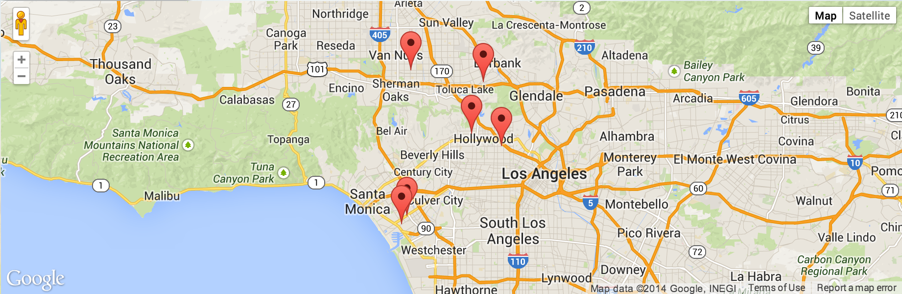
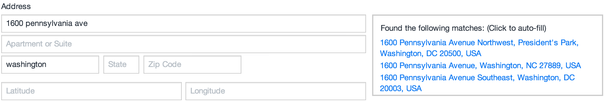
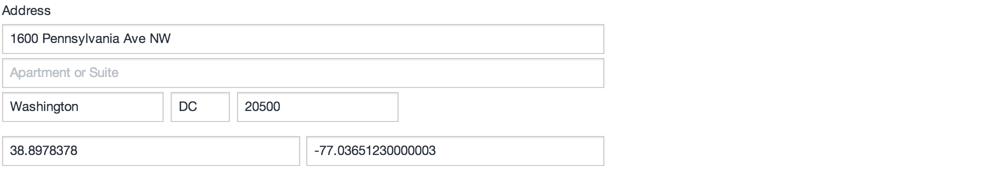

_The smart way to use Google Maps in your Craft site_

# Smart Map

Smart Map is a plugin which allows you to easily manage geographic points. With Smart Map, you can:

- Automatically calculate latitude & longitude
- Display your locations on a dynamic or static map
- Search entries to find the closest location
- ... and more!

Once you have installed the Smart Map plugin, simply create a new field using the "Address (Smart Map)" field type, and add it to a section. You'll see the magic once you start editing entries in that section!

## Using an Address field

As you begin entering an address, a list of possible matches will appear. You can simply click on the address which matches the one you are entering, and the remaining fields will be filled in automatically.

You may see an address option which is very close to correct, but perhaps some of the information is a little off (perhaps it's showing the correct zip code, but a neighboring city name)... You can easily correct any of the address information after picking out the closest match. This allows the latitude and longitude to be calculated automatically.

It's the latitude and longitude that are so important... This information is used to plot each address on a map. It is also used when searching through existing addresses, to determine which of them is closest to your target.

---------------------------------------

## Using your Address field values in a template

How to display your Address values:

    
        <h1>{{ entry.title }}</h1>
        

            {{ entry.myFieldHandle.street1 }} 
            {{ entry.myFieldHandle.street2 }} 
            {{ entry.myFieldHandle.city }}, {{ entry.myFieldHandle.state }} {{ entry.myFieldHandle.zip }} 
        

        

            Latitude: {{ entry.myFieldHandle.lat }} 
            Longitude: {{ entry.myFieldHandle.lng }}
        

    

The code above will render an address like this:

---------------------------------------

## How to sort entries by closest locations

Include this in your "craft.entries" call:

    .myFieldHandle(params).order('distance')

This will tell Craft to:
 - Filter your Address field with the parameter you specify.
 - Order the results by closest distance from your specified target.

      {# example.com?near=90210 #}
    
    
    
    
    <h1>Showing results for "{{ target }}"...</h1>
    
        <h2>{{ entry.title }}</h2>
        

            {{ entry.myFieldHandle.street1 }} 
            {{ entry.myFieldHandle.street2 }} 
            {{ entry.myFieldHandle.city }}, {{ entry.myFieldHandle.state }} {{ entry.myFieldHandle.zip }} 
            <strong>{{ entry.myFieldHandle.distance | number_format(1) }} miles away</strong>
        

    
        <h2>No results found</h2>
    

Your target can be anything that translates into a full or partial address...
 - 90210
 - Aurora, IL
 - 742 Evergreen Terrace

All parameters are optional.

<table>
    <tr>
        <th>Parameter</th>
        <th>Default</th>
        <th>Description</th>
    </tr>
    <tr>
        <td>target</td>
        <td>(autodetects current location)</td>
        <td>Starting point for proximity search</td>
    </tr>
    <tr>
        <td>range</td>
        <td>25</td>
        <td>Search radius, measured in "units"</td>
    </tr>
    <tr>
        <td>units</td>
        <td>"miles"</td>
        <td>Units of measurement ("miles" or "kilometers")</td>
    </tr>
</table>

---------------------------------------

## How to render a Google Map of your locations

Add this Twig tag to your template:

    {{ craft.smartMap.map(locations, options) }}

... which will automatically render a container for your Google Map:

    

There are several options available to customize your map:

    
    
    
    {{ craft.smartMap.map(locations, options) }}

<table>
    <tr>
        <th>Options</th>
        <th>Type</th>
        <th>Default</th>
        <th>Description</th>
    </tr>
    <tr>
        <td>id</td>
        <td>string</td>
        <td>"smartmap-mapcanvas"</td>
        <td>Set id attribute of container.</td>
    </tr>
    <tr>
        <td>width</td>
        <td>int</td>
        <td><em>null</em></td>
        <td>Width of map (in px)</td>
    </tr>
    <tr>
        <td>height</td>
        <td>int</td>
        <td><em>null</em></td>
        <td>Height of map (in px)</td>
    </tr>
    <tr>
        <td>zoom</td>
        <td>int</td>
        <td>8</td>
        <td>Zoom level <em>(higher number = greater detail)</em></td>
    </tr>
    <tr>
        <td>center</td>
        <td>array</td>
        <td>(avg. of all coords)</td>
        <td>Map center, ie: {'lat':38.897837, 'lng':-77.036512}</td>
    </tr>
</table>

---------------------------------------

<!--  -->

## How to render a static map of your locations

The Twig tag for rendering a static map is _almost exactly the same_ as the tag for rendering a Google Map (shown above). There is only one subtle difference... instead of calling the method "map", use the method "img".

    {{ craft.smartMap.img(locations, options) }}

Otherwise, everything else about these two tags is identical. They both take locations and options in the same order... but one renders a dynamic map while the other renders a static map.

---------------------------------------

## Linking directly to a Google Map page

    <a href="{{ craft.smartMap.linkToGoogle(entry.myFieldHandle) }}" target="_blank">Open Google Map in new page</a>

---------------------------------------

# Help, my map isn't appearing!

Check your DOM to see if the map container has been generated. If it has, then you're probably facing a simple CSS issue. By default, the "height" of a div will be zero... So even though the container is there, it isn't visible.

**Ways to fix it:**
 - Add a "height" value to your map options.
 - Set the height of ".smartmap-mapcanvas" in your style sheet.